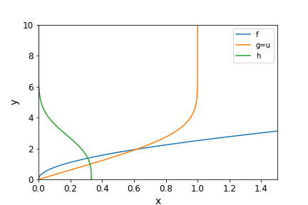
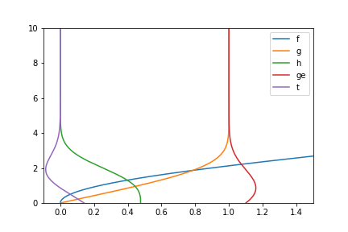

# Blasius equation
Solution of the  [Blasius equation](https://en.wikipedia.org/wiki/Blasius_boundary_layer) for a laminar incompressible and compressible boundary layer flow

## Requirements
~~~~
python3 -m pip install pandas matplotlib numpy
~~~~

## Usage
~~~~
python3 blasius_cp.py
~~~~

## Results

### Incompressible

### Compressible

