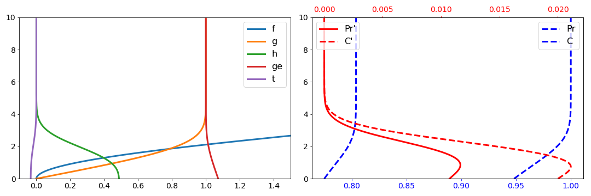

# Laminar Boundary Layer
Solution of the for a laminar incompressible (using the [Blasius equation](https://en.wikipedia.org/wiki/Blasius_boundary_layer)) and compressible boundary layer flow.

## Requirements
~~~~
python3 -m pip install pandas matplotlib numpy CoolProp
~~~~

## Usage
~~~~
python3 blasius_cp.py
~~~~

## Results

### Incompressible

### Compressible

